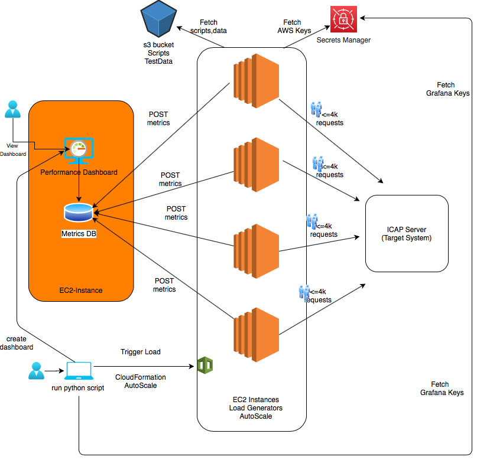
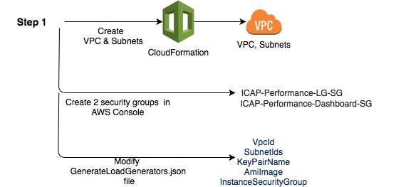

## Introduction
The AWS Performance Test Execution Framework is a custom built auto scalable solution that uses generated EC2 instances with a JMeter test module to simulate user traffic to the ICAP server.

Overall, logical structure looks like this:



In nutshell, user triggers python script to indicate what kind of load needs to be generated, then automation will take care of creating necessary EC2 instances that will trigger load and also it will create performance analytics dashboard automatically.

There are 2 AWS community images created in AWS Ireland, North Virginia, Oregon and North California regions in order to make use of this performance test framework more easier:

 - ICAPServer-Performance-Analytics-Dashboard - this image is used to create Performance Dashboard automatically
 - ICAPServer-Performance-Load-Generator - this image is used during Load Generation triggering in EC2 Auto Scale Cloudformation script.

This document will show simple way to get started utilizing this framework step by step.

**Before starting**
- Make sure to clone https://github.com/k8-proxy/aws-jmeter-test-engine.git this repo with release_v1.0 branch to your local machine.
```
git clone --branch release_v1.0 https://github.com/k8-proxy/aws-jmeter-test-engine.git
```

- Ensure that you have write access to VPC, Subnets, EC2, Security Group, S3, IAM Role,  CloudFormation and Secrets Manager services in AWS.
- Install AWS CLI in your local machine: https://docs.aws.amazon.com/cli/latest/userguide/install-cliv2.html
- Ensure that all resources are created (using instructions below) in a single AWS       supported region, not in multi-regions. Mixing them between different regions might    break the automation or also slow it down due to network latency.


## How to get started?

# Step 1. VPC, Subnets & Security Groups creation


**Create VPC and Subnets if non existent**

If there are no existing VPC and Subnets available then there are separate Cloudformation scripts are available to create VPC & Subnets for each of supported regions mentioned above. 
Scripts are located in jmeter-icap/cloudformation/ repo folder or direct link https://github.com/k8-proxy/aws-jmeter-test-engine/tree/release_v1.0/jmeter-icap/cloudformation 

Ensure that correct region VPC & Subnets cloudformation is used during the stack creation.

The VPC & Subnets cloudformation stack can be created using 2 ways:
- Using AWS Console -> Goto Services -> CloudFormation->Create Stack (new resources) and follow steps there
- Using AWS CLI command (this is template command, repo path and CF name needs to be changed)
```bash
aws cloudformation create-stack --stack-name myteststack --template-body file:///pathtorepo/jmeter-icap/cloudformation/AWS-CloudFormation-VPC-6-Subnets-change-region.json

```
**Create 2 security groups**  

1. Security group for Load Generators:  ICAP-Performance-LG-SG
2. Security group for Dashboard instance: ICAP-Performance-Dashboard-SG
    - Incoming rule: 
       - port 3000 - from your local IP
       - port 3100 - from load generator security group
       - port 8086 - from load generator security group

**Checking & replacing values in the GenerateLoadGenerators.json script**

In your local copy of the repo it's worth checking a few things in the cloudformation script: https://github.com/k8-proxy/aws-jmeter-test-engine/blob/release_v1.0/jmeter-icap/cloudformation/GenerateLoadGenerators.json

**Replace & save the following parameters with your own value**:

- VpcId - vpc id created above

- SubnetIds - public subnets ids list created above

- KeyPairName - your key pair name used to access AWS EC2 instances. If you do not have one, it can be created from AWS console.

- AmiImage - this is id (ami-088f46d6d2a758a97) from ICAPServer-Performance-Load-Generator AWS community image

- InstanceSecurityGroup - ICAP-Performance-LG-SG (created above) security group id

AMI, Security Group, and Key Pair Name can all be found under the EC2 Service.
VPC and Subnets can be found under the VPC Service.

# Step 2. Setup Performance Dashboard system

Create new EC2 instance using ICAPServer-Performance-Analytics-Dashboard - ami-039215eee67c4041e image from AWS community using the following steps:

- Click on Launch Instance
- Type "icapserver" in search field & click enter
- Click on "Community AMIs"
- Select "ICAPServer-Performance-Analytics-Dashboard" AMI
- Select t3.medium (for average use) instance type
- Select desired VPC and public subnet (created in step1, or existing own one can be used)
- Auto Assign Public IP & leave all other options as default
- Click Add Storage, then Click Add Tags : Create Name tag to identify your instance
- Next Configure security group: Select ICAP-Performance-Dashboard-SG created in step 1
- Review & Launch. Select your own keypair or create new one.
- Open Browser and enter http://[instance public ip]:3000
- Grafana ui opens and login with username/password: admin/glasswall

If you do not wish to use ready image, rather create everything from scratch then follow these instructions:
https://github.com/k8-proxy/aws-jmeter-test-engine/blob/release_v1.0/jmeter-icap/instructions/How-to-Install-InfluxDB-Grafana-Loki-on-Amazon-Linux.md

# Step 3. Create S3 bucket

Create private s3 bucket in one of the regions (Ireland,North Virginia, Oregon, North California). The s3 bucket is used to store performance test scripts and data. 

- Goto Services
- Select S3
- Click Create Bucket
- Give unique bucket name and select desired region (ensure that you select same region as the Performance Dashboard instance AWS region)
- Click on Create Bucket button

# Step 4. Create IAM User with only programmatic read/write access to S3 and store access keys in AWS Secrets Manager.

This key is used to access s3 bucket where test data is.
Performance test Jmeter script expects that these keys are passed to it. 

**1. Create IAM User**
 - Goto Services 
 - Select IAM
 - Select users
 - Add user
 - Enter username and Select programmatic access
 - Click on Next Permissions
 - Select Attach Existing Policies
 - Search for AmazonS3FullAccess policy
 - Select the policy
 - Click on Next Tags -> Review -> Create User
 - Key AWS keys in safe place

**2. Create Secrets key in AWS Secrets Manager**

- Goto Services
- Select Secrets Manager
- Click on Store New Secret
- Select Other types of secrets
- Enter following secret keys and values
    1. Secret Key Name = Access key ID 
       Secret Value = Your access key here created just before
    2. Click Add row
       Secret Key = Secret access key
       Secret Value = Your AWS secret access key created just before
- Click next and give Name
- Click next and select disable automatic rotation
- Click next and click Store
- Select secrets name created and save Secret ARN. it will be used in step 5

# Step 5. Create AWS IAM Role with Access to AWS Secret Manager and to S3 bucket

LoadGenerator instances will need to access S3 to fetch data and also access Secrets Manager to get AWS & grafana keys. 

In order to have that access we need to assign IAM role to the LoadGenerator Instances.

There is cloudformation in place to automatically create the IAM role. 
The cloudformation script is located in your local clone of git repo under jmeter-icap/cloudformation/aws-secret-manager-with_iam_role.json or direct url from the repo is: https://github.com/k8-proxy/aws-jmeter-test-engine/blob/release_v1.0/jmeter-icap/cloudformation/aws-secret-manager_with_-iam-role.json Cloudformation script.

One change needs to be done to local copy of this cloudformation script before running it, Find "Resource" as shown below:

```bash
"Resource": [
                                        "arn:aws:s3:::*/*",
                                        "arn:aws:s3:::aws-testengine-s3"
                                    ]
```
and replace **aws-testengine-s3** name with your own bucket name created above.

Save changes.
There are 2 ways to run CloudFormation script in aws:
1. Using Console
   - Find CloudFormation Service in AWS console from Services -> Search for CloudFormation
   - Click on Create Stack
   - Select Upload Template
   - Click Next
   - Give stack name
   - Enter Secrets manager Secret ARN created in step 4 above for AWS keys.
   - Click next until it says create and then click create.
2. Using AWS CLI

```bash
aws cloudformation create-stack --stack-name myteststack --template-body file:///pathtorepo/jmeter-icap/cloudformation/aws-secret-manager_with_-iam-role.json --parameters SecretManagerArn=enter secret ARN created in step 4

```

# Step 6. Create Grafana API key and store them in AWS Secrets Manager

Follow Prerequisites from https://github.com/k8-proxy/aws-jmeter-test-engine/blob/release_v1.0/jmeter-icap/instructions/how-to-use-create_dashboards-script.md this link to create Grafana API key.

Store keys in AWS Secrets Manager using same steps as step 4.

Secret Key = Grafana_Api_Key
Secret Value = Your grafana api key value here

# Step 7. Copy Test Data to S3 & Run python script to trigger load

**Copy Test Data**

- Download gov_uk_files.zip to your local machine from jmeter-icap/test-data/
- unzip the file
- upload it's contents to s3 bucket created earlier
- The folder structure of the test files s3 bucket should be ->  filetype->hashfolders->files

**Run python script to trigger load**

Next step, please, follow the following instructions to start the load:

https://github.com/k8-proxy/aws-jmeter-test-engine/blob/release_v1.0/jmeter-icap/instructions/how-to-use-create_stack_dash.md

## Video Tutorial

The following video tutorial shows how Steps 1-6 are done:

[](http://www.youtube.com/watch?v=S1r-twJcG64 "Steps 1-6 Tutorial")

The following video tutorial shows how to generate load using the framework:

[](http://www.youtube.com/watch?v=gaM3F1FTweU "How to Generate Load? ")


