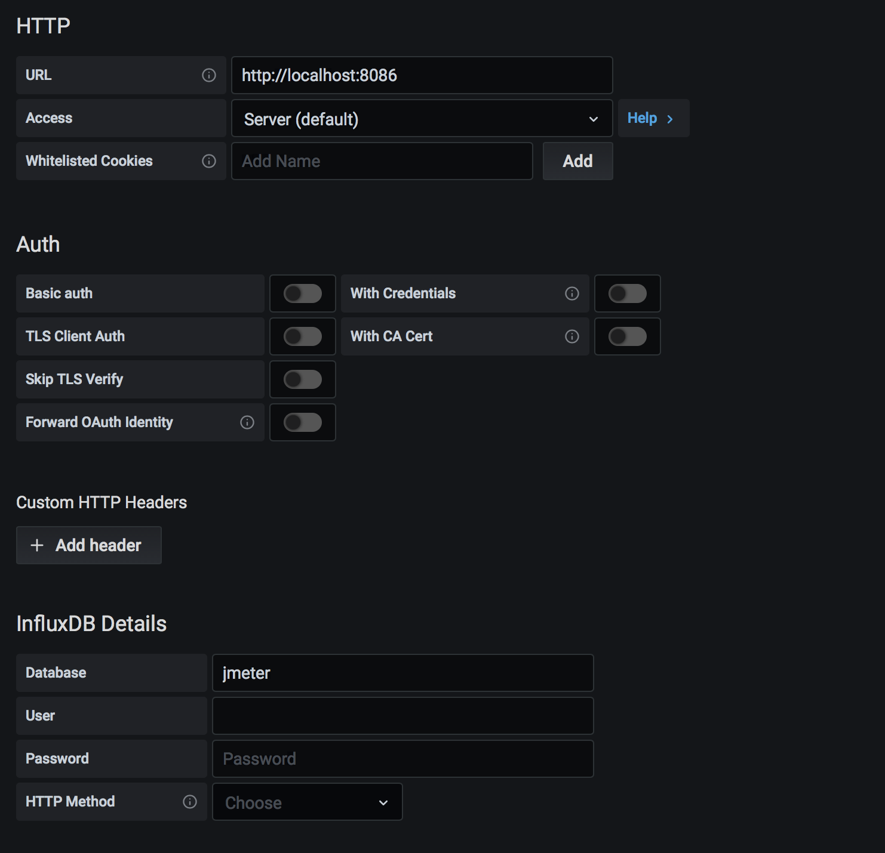

# How to integrate JMeter with InfluxDB & Grafana

## Firewall opening need

1. Loadgenerators should be able to connect to InfluxDB via port 8086.

Incoming firewall rule:
In virtual machine (hosting InfluxDB) security group the following incoming rule should exist
Source : Load Generator Security Group or IP addresses
Port: 8086

2. End users should be able to connect to Grafana via port 3000.
Incoming firewall rule:
In virtual machine (hosting grafana) security group the following incoming rule should exist
Source : End users IP range
Port: 3000


## Create Influx DB database called "jmeter"

Run the following in Linux host machine where InfluxDB is installed:
```bash
[ec2-user@ip-172-31-83-255 ~]$ influx
Connected to http://localhost:8086 version 1.8.2
InfluxDB shell version: 1.8.2
> show databases;
name: databases
name
----
_internal
> create database jmeter
> show databases;
name: databases
name
----
_internal
jmeter
```
## Add influxdb source to grafana 

1. Login to Grafana. 
     Default Grafana default username/password is admin/admin. Grafana will ask to change it after first login.

2. Goto Configuration->Data Sources
    
    Direct Link is http://grafanaIP:3000/datasources

3. Click Add Datasource

4. Enter http://localhost:8086 for URL and jmeter for database and click on "save and test" button




## Add BackendListener to JMeter Script

1. Right click on JMeter Test Plan - Add-> Listener->Backend Listener
2. In Backend listener implementation select Influxb client
3. Enter influxdb ip address and also set other parameters according to picture below:


